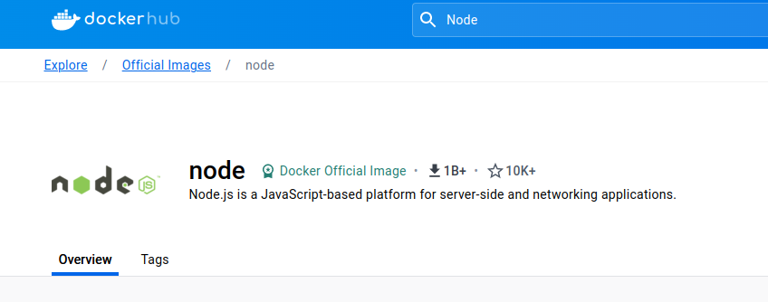
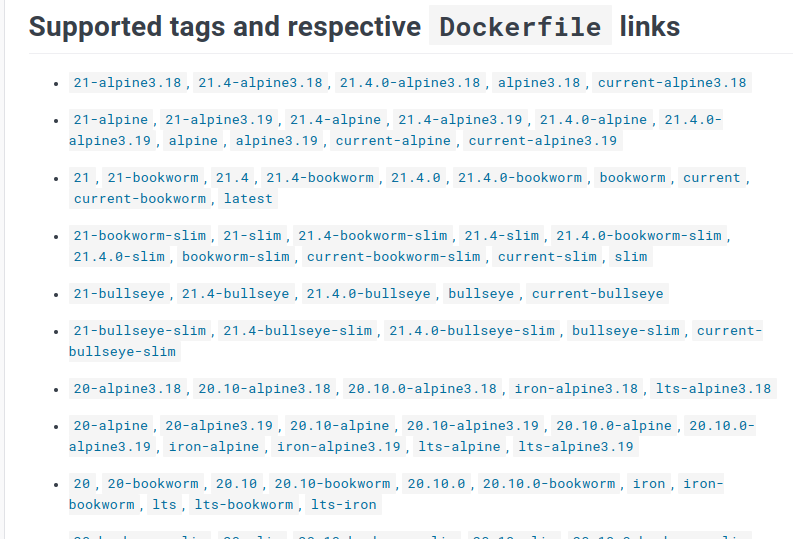
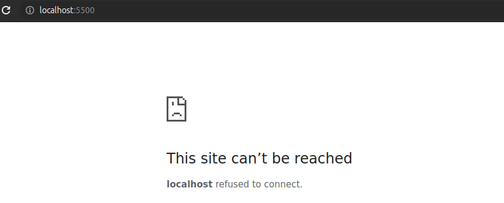
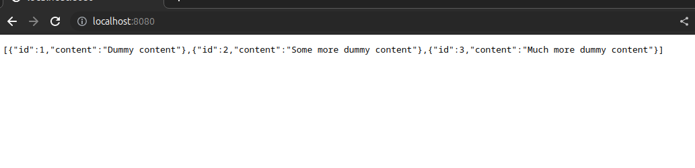

# Learning Docker

**GPT: What is Docker?**

> Docker allows you to package an application and its dependencies into a
> container, which is a lightweight, standalone, and executable software package.
> These containers run on a shared operating system kernel, but they are isolated
> from each other. Unlike virtual machines (VMs), which emulate an entire
> operating system and run on a hypervisor, containers share the host OS kernel
> and use resources more efficiently. Docker containers provide a consistent and
> reproducible environment, making it easier to develop, deploy, and scale
> applications across different environments.

**GPT: What is Docker images and containers?**

> **Docker Images:** It's a bundle that packs up all the necessary stuff your
> software needs to run, like code and tools. Think of it as a snapshot of a
> complete environment.
>
> **Docker Containers:** Now take that bundle, unpack it, and run it. A
> container is like a live, isolated version of your software, doing its job
> without messing with anything else on your system.
---

**Table of Contents:**

- [Learning Docker](#learning-docker)
  - [Get started](#get-started)
  - [Images](#images)
    - [Pulling images](#pulling-images)
    - [Listing images](#listing-images)
    - [Removing images](#removing-images)
    - [Image Commands](#image-commands)
  - [Containers](#containers)
    - [Creating containers](#creating-containers)
    - [Starting containers](#starting-containers)
    - [Listing containers](#listing-containers)
    - [Stopping containers](#stopping-containers)
      - [Stopping all at once](#stopping-all-at-once)
    - [Pruning all containers](#pruning-all-containers)
    - [Container commands](#container-commands)
  - [Creating and running your own Images](#creating-and-running-your-own-images)
    - [`Dockerfile`](#dockerfile)
      - [Create `Dockerfile`](#create-dockerfile)
      - [Adding parent Image (a.k.a base image)](#adding-parent-image-aka-base-image)
      - [Copying source code](#copying-source-code)
      - [Installing dependencies](#installing-dependencies)
      - [Exposing container port](#exposing-container-port)
      - [Running commands](#running-commands)
    - [Building image](#building-image)
      - [Building images with tag](#building-images-with-tag)
    - [Running image](#running-image)
      - [Running Image with options](#running-image-with-options)
    - [`.dockerignore`](#dockerignore)
    - [Layer Caching](#layer-caching)
      - [Fixing dependencies cache issue](#fixing-dependencies-cache-issue)
  - [Volumes](#volumes)
    - [Creating volume](#creating-volume)
  - [Commands table](#commands-table)
    - [Options table](#options-table)
      - [`docker run`](#docker-run)
      - [`docker build`](#docker-build)
  - [References](#references)

---

## Get started

**Adding official repository:**

```sh
sudo apt-get update
sudo apt-get install ca-certificates curl gnupg
sudo install -m 0755 -d /etc/apt/keyrings
curl -fsSL https://download.docker.com/linux/ubuntu/gpg | sudo gpg --dearmor -o /etc/apt/keyrings/docker.gpg
sudo chmod a+r /etc/apt/keyrings/docker.gpg

# Add the repository to Apt sources:
echo \
  "deb [arch=$(dpkg --print-architecture) signed-by=/etc/apt/keyrings/docker.gpg] https://download.docker.com/linux/ubuntu \
  $(. /etc/os-release && echo "$VERSION_CODENAME") stable" | \
  sudo tee /etc/apt/sources.list.d/docker.list > /dev/null
sudo apt-get update
```

**Installation:**

```sh
sudo apt-get install docker-ce docker-ce-cli containerd.io docker-buildx-plugin docker-compose-plugin
```

**Granting docker privileges for an user:**

To grant privileges and be able to run `docker` instead of `sudo docker`

```sh
sudo usermod -aG docker %USER%
```

> replace `%USER%` for your user

Then logout and login again

**Testing installation:**

```sh
docker run hello-world
```

**Output:**

```mono
Hello from Docker!
This message shows that your installation appears to be working correctly.

To generate this message, Docker took the following steps:
 1. The Docker client contacted the Docker daemon.
 2. The Docker daemon pulled the "hello-world" image from the Docker Hub.
    (amd64)
 3. The Docker daemon created a new container from that image which runs the
    executable that produces the output you are currently reading.
 4. The Docker daemon streamed that output to the Docker client, which sent it
    to your terminal.

To try something more ambitious, you can run an Ubuntu container with:
 $ docker run -it ubuntu bash

Share images, automate workflows, and more with a free Docker ID:
 https://hub.docker.com/

For more examples and ideas, visit:
 https://docs.docker.com/get-started/

```

## Images

The first use an image will be downloading it
from [Docker hub](https://hub.docker.com/) in our example we will be looking for
the official `node` parent image (a.k.a base image)

On the Docker Hub we search for `node`



To download the official image that will be our parent image (a.k.a base image),
you will notice a field with the respective command do download it:


But this the basic command, this will install the latest image version, if you
want to install a specific version you will have to check the `Tag` section that
lists all the available versions that can be used



> `alphine` suggests that this tag has the slimmest size

But for now let's install the latest version

### Pulling images

To download an image we need to run de pull command

```sh
docker pull node
```

**Output:**

```mono
Using default tag: latest
latest: Pulling from library/node
90e5e7d8b87a: Pull complete 
27e1a8ca91d3: Pull complete 
d3a767d1d12e: Pull complete 
711be5dc5044: Pull complete 
22956530cc64: Pull complete 
5a84ca09aa3e: Pull complete 
27379e7795cc: Pull complete 
3a3f52d0acb3: Pull complete 
Digest: sha256:db2672e3c200b85e0b813cdb294fac16764711d7a66b41315e6261f2231f2331
Status: Downloaded newer image for node:latest
docker.io/library/node:latest
```

### Listing images

To list the images pulled run:

```sh
docker images

# OR

docker image ls
```

**Output:**

```mono
REPOSITORY    TAG       IMAGE ID       CREATED        SIZE
node          latest    b866e35a0dc4   12 days ago    1.1GB
hello-world   latest    9c7a54a9a43c   7 months ago   13.3kB
```

Alternatively you can list the version installed like this:

```sh
docker images --format "{{.Repository}}:{{.Tag}}"
```

**Output:**

```mono
node:latest
hello-world:latest
```

### Removing images

To remove a image that is no longer used we use the following
syntax: `docker rmi [OPTIONS] IMAGE[:TAG|@DIGEST]`

Let's remove the `hello-world` image used to test docker installation

```sh
docker rmi hello-world:latest
```

**Output:**

```mono
Error response from daemon: conflict: unable to remove repository reference "hello-world:latest" (must force) - container daef4bf20a61 is using its referenced image 9c7a54a9a43c
```

Okay since the image is installed with docker we have to force it to be removed,
for that we use the option `-f` just like we do with github

```sh
docker rmi hello-world:latest -f
```

> Notice that the container also an be removed by it's ID, it would be something
> like that `docker rmi 1f33c17521fc -f`

**Output:**

```mono
Untagged: hello-world:latest
Untagged: hello-world@sha256:c79d06dfdfd3d3eb04cafd0dc2bacab0992ebc243e083cabe208bac4dd7759e0
Deleted: sha256:9c7a54a9a43cca047013b82af109fe963fde787f63f9e016fdc3384500c2823d
```

Let's check if it worked:

```sh
docker images
```

**Output:**

```mono
REPOSITORY   TAG       IMAGE ID       CREATED       SIZE
node         latest    b866e35a0dc4   12 days ago   1.1GB
```

### Image Commands

Use `docker image` to list all available images commands

| **Command** | **Description**                                                          |
|:------------|:-------------------------------------------------------------------------|
| build       | Build an image from a Dockerfile                                         |
| history     | Show the history of an image                                             |
| import      | Import the contents from a tarball to create a filesystem image          |
| inspect     | Display detailed information on one or more images                       |
| load        | Load an image from a tar archive or STDIN                                |
| ls          | List images                                                              |
| prune       | Remove unused images                                                     |
| pull        | Download an image from a registry                                        |
| push        | Upload an image to a registry                                            |
| rm          | Remove one or more images                                                |
| save        | Save one or more images to a tar archive (streamed to STDOUT by default) |
| tag         | Create a tag TARGET_IMAGE that refers to SOURCE_IMAGE                    |

## Containers

Containers are running instances of images, since images are the blueprint of a
container a running image produces a container

### Creating containers

To create a containers we need to run the image we pulled from the Docker Hub

```sh
docker run node:latest 
```

You will notice that nothing will happen in some cases, but keep in mind that
this is okay, alternatively you can use the option `-it` to run the container in
interactive mode and get a shell prompt within the container

```sh
docker run -it node:latest
```

**Output:**

```mono
Welcome to Node.js v21.4.0.
Type ".help" for more information.
> 
```

### Starting containers

Well to start a existing container we use the `start` command

First let's list the existing containers:

```sh
docker ps -a
```

**Output:**

```mono
CONTAINER ID   IMAGE          COMMAND                  CREATED              STATUS                       PORTS     NAMES
58cdb651af75   my-dummy-api   "docker-entrypoint.s…"   About a minute ago   Exited (137) 8 seconds ago             amazing_carson
```

Noticed that the status column shows `Exited` which means this container is
stopped

So to start this existing container we need to run the `start` command giving
it's name or Id as parameter

```sh
docker start amazing_carson

OR 

docker start 58cdb651af75
```

### Listing containers

To check the list of running Docker containers, you can use the docker ps
command. By default, this command shows you the currently running containers
along with some basic information such as the container ID, names, ports, and
status.

```sh
docker ps
```

**Output:**

```mono
CONTAINER ID   IMAGE         COMMAND                  CREATED              STATUS              PORTS     NAMES
1e01607fe8fb   node:latest   "docker-entrypoint.s…"   About a minute ago   Up About a minute             great_mccarthy
```

If you want to check all containers including those which are stopped you ca add
the option `-a`

```sh
docker ps -a
```

**Output:**

```mono
CONTAINER ID   IMAGE          COMMAND                  CREATED          STATUS                      PORTS     NAMES
1e01607fe8fb   node:latest    "docker-entrypoint.s…"   3 minutes ago    Up 3 minutes                          great_mccarthy
0508d9e6575d   node:latest    "docker-entrypoint.s…"   4 minutes ago    Exited (0) 4 minutes ago              brave_wiles
cf851a3911a3   node:latest    "docker-entrypoint.s…"   9 minutes ago    Exited (0) 9 minutes ago              jolly_chebyshev
fb8990de47ae   node:latest    "docker-entrypoint.s…"   40 minutes ago   Exited (0) 38 minutes ago             cool_goodall
40e4b4aede28   node:latest    "docker-entrypoint.s…"   41 minutes ago   Exited (0) 41 minutes ago             fervent_wing
6d010bf3d669   9c7a54a9a43c   "/hello"                 3 hours ago      Exited (0) 3 hours ago                zealous_einstein
daef4bf20a61   9c7a54a9a43c   "/hello"                 10 days ago      Exited (0) 10 days ago                nice_herschel
```

> To show only the container id you can use `-q`
> To list all containers stopped or running use `-a`

You can also inspect a container

```sh
docker inspect 1e01607fe8fb

# OR

docker inspect great_mccarthy
```

**Output:**

```mono
[
    {
        "Id": "1e01607fe8fb55ddf743ca5a9963b3b1a55f6944d3812f8a860f979cf373e324",
        "Created": "2023-12-18T21:11:15.465482575Z",
        "Path": "docker-entrypoint.sh",
        "Args": [
            "node"
        ],
        "State": {
            "Status": "running",
            "Running": true,
            "Paused": false,
            "Restarting": false,
            "OOMKilled": false,
            "Dead": false,
            "Pid": 34641,
            "ExitCode": 0,
            "Error": "",
            "StartedAt": "2023-12-18T21:11:16.460797208Z",
            "FinishedAt": "0001-01-01T00:00:00Z"
        },
        "Image": "sha256:b866e35a0dc4df85e168524b368567023eb22b06fe16f2237094e937fcd24d96",
        "ResolvConfPath": "/var/lib/docker/containers/1e01607fe8fb55ddf743ca5a9963b3b1a55f6944d3812f8a860f979cf373e324/resolv.conf",
        "HostnamePath": "/var/lib/docker/containers/1e01607fe8fb55ddf743ca5a9963b3b1a55f6944d3812f8a860f979cf373e324/hostname",
        "HostsPath": "/var/lib/docker/containers/1e01607fe8fb55ddf743ca5a9963b3b1a55f6944d3812f8a860f979cf373e324/hosts",
        "LogPath": "/var/lib/docker/containers/1e01607fe8fb55ddf743ca5a9963b3b1a55f6944d3812f8a860f979cf373e324/1e01607fe8fb55ddf743ca5a9963b3b1a55f6944d3812f8a860f979cf373e324-json.log",
        "Name": "/great_mccarthy",
        "RestartCount": 0,
        "Driver": "overlay2",
        "Platform": "linux",
        "MountLabel": "",
        "ProcessLabel": "",
        "AppArmorProfile": "docker-default",
        "ExecIDs": null,
        "HostConfig": {
            "Binds": null,
            "ContainerIDFile": "",
            "LogConfig": {
                "Type": "json-file",
                "Config": {}
            },
            "NetworkMode": "default",
            "PortBindings": {},
            "RestartPolicy": {
                "Name": "no",
                "MaximumRetryCount": 0
            },
            "AutoRemove": false,
            "VolumeDriver": "",
            "VolumesFrom": null,
            "ConsoleSize": [
                52,
                205
            ],
            "CapAdd": null,
            "CapDrop": null,
            "CgroupnsMode": "private",
            "Dns": [],
            "DnsOptions": [],
            "DnsSearch": [],
            "ExtraHosts": null,
            "GroupAdd": null,
            "IpcMode": "private",
            "Cgroup": "",
            "Links": null,
            "OomScoreAdj": 0,
            "PidMode": "",
            "Privileged": false,
            "PublishAllPorts": false,
            "ReadonlyRootfs": false,
            "SecurityOpt": null,
            "UTSMode": "",
            "UsernsMode": "",
            "ShmSize": 67108864,
            "Runtime": "runc",
            "Isolation": "",
            "CpuShares": 0,
            "Memory": 0,
            "NanoCpus": 0,
            "CgroupParent": "",
            "BlkioWeight": 0,
            "BlkioWeightDevice": [],
            "BlkioDeviceReadBps": [],
            "BlkioDeviceWriteBps": [],
            "BlkioDeviceReadIOps": [],
            "BlkioDeviceWriteIOps": [],
            "CpuPeriod": 0,
            "CpuQuota": 0,
            "CpuRealtimePeriod": 0,
            "CpuRealtimeRuntime": 0,
            "CpusetCpus": "",
            "CpusetMems": "",
            "Devices": [],
            "DeviceCgroupRules": null,
            "DeviceRequests": null,
            "MemoryReservation": 0,
            "MemorySwap": 0,
            "MemorySwappiness": null,
            "OomKillDisable": null,
            "PidsLimit": null,
            "Ulimits": null,
            "CpuCount": 0,
            "CpuPercent": 0,
            "IOMaximumIOps": 0,
            "IOMaximumBandwidth": 0,
            "MaskedPaths": [
                "/proc/asound",
                "/proc/acpi",
                "/proc/kcore",
                "/proc/keys",
                "/proc/latency_stats",
                "/proc/timer_list",
                "/proc/timer_stats",
                "/proc/sched_debug",
                "/proc/scsi",
                "/sys/firmware",
                "/sys/devices/virtual/powercap"
            ],
            "ReadonlyPaths": [
                "/proc/bus",
                "/proc/fs",
                "/proc/irq",
                "/proc/sys",
                "/proc/sysrq-trigger"
            ]
        },
        "GraphDriver": {
            "Data": {
                "LowerDir": "/var/lib/docker/overlay2/3c5fea15736bc2e997488e2fa00464579f8be14c937db169e9d5c5b148cb91d6-init/diff:/var/lib/docker/overlay2/86cbd5491742bc67838f5b368433803621806a437302e31687c5acc8d38a1fd8/diff:/var/lib/docker/overlay2/a67b4b36d1d3570cd98117019a270bf1f323b2fc26e41bf1dd63e6a3856552f3/diff:/var/lib/docker/overlay2/91ffcd243591df5f0f930e191035ffb917502a6ba2457bf907d5d52f6619c43a/diff:/var/lib/docker/overlay2/5505d50b68159923351dce084cb9b1382903a15a2d095afe131b87f4a1fbbe3f/diff:/var/lib/docker/overlay2/0aa7ac21f3ce381f927f953a30f60b698ecc344061400e39f35cdf3ac6ebde07/diff:/var/lib/docker/overlay2/6ef5d962cb6fa176bfc3e95dd6c0ff632282f2ce88c57c1aafcc20f4a88665d0/diff:/var/lib/docker/overlay2/76e711ba5fa06de20314d995f5393b69d0a956f2710f87623b9256d4d241109f/diff:/var/lib/docker/overlay2/659a0ae5bdd02fdabe36e6fa7123e616b35690af56a5f3b2b081aebf4ac518c5/diff",
                "MergedDir": "/var/lib/docker/overlay2/3c5fea15736bc2e997488e2fa00464579f8be14c937db169e9d5c5b148cb91d6/merged",
                "UpperDir": "/var/lib/docker/overlay2/3c5fea15736bc2e997488e2fa00464579f8be14c937db169e9d5c5b148cb91d6/diff",
                "WorkDir": "/var/lib/docker/overlay2/3c5fea15736bc2e997488e2fa00464579f8be14c937db169e9d5c5b148cb91d6/work"
            },
            "Name": "overlay2"
        },
        "Mounts": [],
        "Config": {
            "Hostname": "1e01607fe8fb",
            "Domainname": "",
            "User": "",
            "AttachStdin": true,
            "AttachStdout": true,
            "AttachStderr": true,
            "Tty": true,
            "OpenStdin": true,
            "StdinOnce": true,
            "Env": [
                "PATH=/usr/local/sbin:/usr/local/bin:/usr/sbin:/usr/bin:/sbin:/bin",
                "NODE_VERSION=21.4.0",
                "YARN_VERSION=1.22.19"
            ],
            "Cmd": [
                "node"
            ],
            "Image": "node:latest",
            "Volumes": null,
            "WorkingDir": "",
            "Entrypoint": [
                "docker-entrypoint.sh"
            ],
            "OnBuild": null,
            "Labels": {}
        },
        "NetworkSettings": {
            "Bridge": "",
            "SandboxID": "a1acf55e021493149ee9705f5a384ef9460f07a8df6dcac7bb9952c2d02d434a",
            "HairpinMode": false,
            "LinkLocalIPv6Address": "",
            "LinkLocalIPv6PrefixLen": 0,
            "Ports": {},
            "SandboxKey": "/var/run/docker/netns/a1acf55e0214",
            "SecondaryIPAddresses": null,
            "SecondaryIPv6Addresses": null,
            "EndpointID": "046ed095ab8eaf716698594286f39dbf1ad6d15b8e25ec4f13cd28ccced519d6",
            "Gateway": "172.17.0.1",
            "GlobalIPv6Address": "",
            "GlobalIPv6PrefixLen": 0,
            "IPAddress": "172.17.0.2",
            "IPPrefixLen": 16,
            "IPv6Gateway": "",
            "MacAddress": "02:42:ac:11:00:02",
            "Networks": {
                "bridge": {
                    "IPAMConfig": null,
                    "Links": null,
                    "Aliases": null,
                    "NetworkID": "1f10cd67380ce84b4997df42ad59001d0baafb163e7605ed7e44db717085f4d1",
                    "EndpointID": "046ed095ab8eaf716698594286f39dbf1ad6d15b8e25ec4f13cd28ccced519d6",
                    "Gateway": "172.17.0.1",
                    "IPAddress": "172.17.0.2",
                    "IPPrefixLen": 16,
                    "IPv6Gateway": "",
                    "GlobalIPv6Address": "",
                    "GlobalIPv6PrefixLen": 0,
                    "MacAddress": "02:42:ac:11:00:02",
                    "DriverOpts": null
                }
            }
        }
    }
]
```

### Stopping containers

To stop a docker container you can use the
syntax `docker stop [OPTIONS] CONTAINER [CONTAINER...]` in our example it would
be like this:

```sh
docker inspect 1e01607fe8fb

# OR

docker stop great_mccarthy
```

#### Stopping all at once

We could also stop various containers giving multiple ids or tags on a single
command, but in cases you want stop all at once there's a small trick:

```sh
docker stop $(docker ps -q)
```

### Pruning all containers

Just as git keeps various branches on disk, docker also keeps various containers
on disk as you ran it, so to ensure that we have a clean slat to create and tag
our containers we might want to remove all existing containers, for that we use
the `prune` command

First lets list our containers:

```sh
docker ps -a
```

> `-a` it's an option to list all containers running or not

**Output:**

```mono
CONTAINER ID   IMAGE          COMMAND                  CREATED          STATUS                       PORTS     NAMES
9a67dd3dce9d   my-dummy-api   "docker-entrypoint.s…"   6 minutes ago    Exited (137) 5 minutes ago             tender_ptolemy
87567fa48eff   my-dummy-api   "docker-entrypoint.s…"   6 minutes ago    Exited (137) 5 minutes ago             intelligent_zhukovsky
b10384c01f19   my-dummy-api   "docker-entrypoint.s…"   6 minutes ago    Exited (137) 5 minutes ago             determined_banach
49a781044feb   my-dummy-api   "docker-entrypoint.s…"   6 minutes ago    Exited (137) 5 minutes ago             cranky_pare
052a1c023c9b   my-dummy-api   "docker-entrypoint.s…"   6 minutes ago    Exited (137) 5 minutes ago             quirky_hertz
925ff736c5ea   my-dummy-api   "docker-entrypoint.s…"   6 minutes ago    Exited (137) 5 minutes ago             vibrant_lalande
680e8f7dcd72   my-dummy-api   "docker-entrypoint.s…"   6 minutes ago    Exited (137) 5 minutes ago             jovial_colden
39ef2b65fd1b   my-dummy-api   "docker-entrypoint.s…"   6 minutes ago    Exited (137) 5 minutes ago             relaxed_margulis
0598bae2708d   my-dummy-api   "docker-entrypoint.s…"   6 minutes ago    Exited (137) 5 minutes ago             awesome_dubinsky
7b4d67a153ee   my-dummy-api   "docker-entrypoint.s…"   6 minutes ago    Exited (137) 5 minutes ago             optimistic_germain
d34a540e9ab3   my-dummy-api   "docker-entrypoint.s…"   7 minutes ago    Created                                exciting_edison
2b300630c2a7   my-dummy-api   "docker-entrypoint.s…"   7 minutes ago    Created                                optimistic_hugle
5e818760d68b   my-dummy-api   "docker-entrypoint.s…"   12 minutes ago   Exited (137) 5 minutes ago             container-1
```

To remove a single container we use `rm` or `rmi`, but to remove it all from the
disk we use:

```sh
docker container prune
```

**Output:**

```mono
WARNING! This will remove all stopped containers.
Are you sure you want to continue? [y/N] y
Deleted Containers:
9a67dd3dce9dc93a1a05fef4562188bf12e10ac98c0421b6a12f01af1cc8373b
87567fa48effb45adbea65f3db4f756e608377668700f1df09758cf85adee3fc
b10384c01f19e65d804bb307a44c71a27e49b7b0bc0690537bb1c230589c09c1
49a781044feb771582fa539c1276a612db831eb2a9a24052af60c3509f6e6b5b
052a1c023c9bda61d18902d44611247381b733f0eb7705e3e420665d06a8644e
925ff736c5eaa9ca922f38162b4a48715576daba3c78c3bf9729c6b97bed4067
680e8f7dcd7211115ff5bd9d0ae573c5f00835485573baa07f8126712ddbd657
39ef2b65fd1bf4f0f28fbb4c105b947f525c61ad70d6e38cac21a8342415ec23
0598bae2708d0ad40083523aaa1d38739bf88fd36f02668f9252d448d1ef8306
7b4d67a153ee958c06895a409e090d6330a8db98fabfec4177de5cc99dbe772e
d34a540e9ab3a581ed8389bb5322a0a5aadb3ae0a6f498381e55a15046eb29d4
2b300630c2a7bb536ec9bd67778bf8ce377ce885ca0548b9cfb12c616850f478
5e818760d68b0fc9f6529fdd411c48c3fad07f3074e80cea8f1696325bcefdd2
```

> Notice that before proceed ir will ask if you are sure about the removal, to
> move along and remove it all you must prompt `y`

### Container commands

Use `docker container` to check all the available commands for containers

| **Command** | **Description**                                                               |
|:------------|:------------------------------------------------------------------------------|
| attach      | Attach local standard input, output, and error streams to a running container |
| commit      | Create a new image from a container's changes                                 |
| cp          | Copy files/folders between a container and the local filesystem               |
| create      | Create a new container                                                        |
| diff        | Inspect changes to files or directories on a container's filesystem           |
| exec        | Execute a command in a running container                                      |
| export      | Export a container's filesystem as a tar archive                              |
| inspect     | Display detailed information on one or more containers                        |
| kill        | Kill one or more running containers                                           |
| logs        | Fetch the logs of a container                                                 |
| ls          | List containers                                                               |
| pause       | Pause all processes within one or more containers                             |
| port        | List port mappings or a specific mapping for the container                    |
| prune       | Remove all stopped containers                                                 |
| rename      | Rename a container                                                            |
| restart     | Restart one or more containers                                                |
| rm          | Remove one or more containers                                                 |
| run         | Create and run a new container from an image                                  |
| start       | Start one or more stopped containers                                          |
| stats       | Display a live stream of container(s) resource usage statistics               |
| stop        | Stop one or more running containers                                           |
| top         | Display the running processes of a container                                  |
| unpause     | Unpause all processes within one or more containers                           |
| update      | Update configuration of one or more containers                                |
| wait        | Block until one or more containers stop, then print their exit codes          |

## Creating and running your own Images

Images are constituted by layers, these layers are responsible to define each
part of the structure that our container will have

The initial layer of a image is called `parent image (a.k.a base image)`, it
will include the OS and some other runtime environment configuration

The following layers are used to download the source code and its dependencies,
and the last layer is the layer where we will run the necessary commands to make
our container ready use

To be able to create a docker image and specify each layer behavior we will need
to create a `Dockerfile`

> In order to learn hands-on we will use a dummy project for the following
> topics
>
> [Example: Project: dummy-api](./src/projects/dummy-api/app.js)

### `Dockerfile`

**GPT: What is a Dockerfile?**

> A Dockerfile is a text file that contains instructions for building a Docker
> image. It serves as a blueprint for creating a lightweight, portable, and
> self-sufficient containerized application. The Dockerfile includes commands to
> specify the parent image (a.k.a base image), set up the environment, copy files,
> install dependencies, and configure the application. When the Dockerfile is used
> with the docker build command, it produces a Docker image that encapsulates the
> application and its dependencies, allowing for consistent deployment across
> different environments.

#### Create `Dockerfile`

So within our dummy project we are going to create a file called `Dockerfile`
without any extension

```tree
.
├── app.js
├── Dockerfile
└── package.json
```

#### Adding parent Image (a.k.a base image)

On or `Dockerfile` each instruction is a layer the first instruction will be
reference to our parent image

```Dockerfile
# ./Dockerfile

FROM node:18-alpine
```

> Notice that it doesn't need to be necessarily the on we pulled locally

#### Copying source code

The second layer will be the copy of our source code, the syntax
is `COPY %FROM% %TO%`, in our case `%FROM%` = `.` (current
folder) `%TO%` = `dummy-api/`

```Dockerfile
# ./Dockerfile

FROM node:18-alpine

COPY . dummy-api/
```

#### Installing dependencies

First to guarantee that the commands we are going to run on the container will
be ran on the exact root of our project we are going to add the
instruction `ẀORKDIR` soon after the `FROM` instruction, by that we specify the
root folder of our container.

After that we will have to adjust the destination for our `COPY` instruction,
since we are defining the `ẀORKDIR` we no longer need to specify the destination
path as we copy because docker will already know where to put the project files.

Soon as we set this up we are ready to set the `RUN` to install our dependencies

```Dockerfile
# ./Dockerfile

FROM node:18-alpine

WORKDIR dummy-api/

COPY . .

RUN yarn install
```

#### Exposing container port

To be specify tje port our containerized environment will be listening the
application on the during runtime we need use the `EXPOSE` instruction, it's
optional but it can be helpful.

```Dockerfile
# ./Dockerfile

FROM node:18-alpine

WORKDIR dummy-api/

COPY . .

RUN yarn install

EXPOSE 5500
```

> Keep in mind that `EXPOSE` doesn't mean that the local machine will have
> direct communication with the container itself, for that we use other options as
> we run the the container image

#### Running commands

After we added the basic instruction to create or container we need to provide
the necessary commands that needs to be executed as the container gets running,
for that we will use the instruction `CMD`,sending an Array of strings with
instruction as parameter:

```Dockerfile
# ./Dockerfile

FROM node:18-alpine

WORKDIR dummy-api/

COPY . .

RUN yarn install

EXPOSE 5500

CMD ["node", "app.js", "--port 5500"]
```

> In our case we are just ask node to run our application

### Building image

After creating the Dockerfile the next step will be to produce a Docker image
from it:

```sh
docker build -t my-dummy-api .
```

> The option `-t` allow us to give a tag name for our image and the `.` means
> where the Dockerfile is relatively to where the build command is called

**Output:**

```mono
[+] Building 8.9s (9/9) FINISHED                                                                                                docker:default
 => [internal] load build definition from Dockerfile                                                                                      0.0s
 => => transferring dockerfile: 156B                                                                                                      0.0s
 => [internal] load .dockerignore                                                                                                         0.0s
 => => transferring context: 52B                                                                                                          0.0s
 => [internal] load metadata for docker.io/library/node:18-alpine                                                                         1.6s
 => [internal] load build context                                                                                                         0.0s
 => => transferring context: 280B                                                                                                         0.0s
 => [1/4] FROM docker.io/library/node:18-alpine@sha256:b1a0356f7d6b86c958a06949d3db3f7fb27f95f627aa6157cb98bc65c801efa2                   0.0s
 => CACHED [2/4] WORKDIR dummy-api/                                                                                                       0.0s
 => [3/4] COPY . .                                                                                                                        0.0s
 => [4/4] RUN yarn install                                                                                                                6.3s
 => exporting to image                                                                                                                    0.9s
 => => exporting layers                                                                                                                   0.8s
 => => writing image sha256:0cd86c0aae46b10d3fd1ef1e10213eb66b66751c6f23fe93cd89776aa4a3021b                                              0.0s 
 => => naming to docker.io/library/my-dummy-api                                                                                           0.0s
```

#### Building images with tag

Docker also allow us to create images with tags, that allow us to have some sort
of organization to our images, to create image with tag we are going to use `:`

```sh
docker build -t my-dummy-api:v1 .
```

After that if we list the images `docker images`:

```mono
REPOSITORY     TAG       IMAGE ID       CREATED          SIZE
my-dummy-api   v1        2d4a40f2d79f   11 seconds ago   139MB
node           latest    b866e35a0dc4   2 weeks ago      1.1GB
```

### Running image

As we created our own image we manage to specify each port we want to `EXPOSE`
as a way of communication between the container and its outer environment

In our example we are using port 5500

If we simply run our image without specify the port we exposed we won't able to
access the application we are running within our container

```sh
docker run my-dummy-api
```

**Output:**

```mono
listening for requests on port 5500
```

If we try to access the localhost on the port `5500` without mentioning it on
the run command, this what we get:



When we use the command forwarding the port accordingly:

```sh
docker run -p 8080:5500 my-dummy-api
```

> Notice that I don't need necessary forward port `5500` to the same port on my
> external environment, we can forward for any port currently available



#### Running Image with options

Another useful option to the run command is the `--name` option, which allow you
to defined custom naming for your container

Let's also add the option `-d` to start or container but without blocking the
terminal

```sh
docker run --name=container-1 -d -p 8080:5500 my-dummy-api
```

So now since our terminal isn't blocked let's run the `docker ps`

```mono
CONTAINER ID   IMAGE          COMMAND                  CREATED         STATUS         PORTS                                       NAMES
5e818760d68b   my-dummy-api   "docker-entrypoint.s…"   8 seconds ago   Up 6 seconds   0.0.0.0:8080->5500/tcp, :::8080->5500/tcp   container-1
```

> Keep in mind that the `run` command is used to create a container, which means
> that if you already have used it once and just want to start the existing
> container use the `start` command giving the container tag as parameter so it
> will keep all the definitions used to create the container like name, port and
> etc..

### `.dockerignore`

Just as git, docker also have a way to ignore files that you don't want to add
to your image, in our case we just are going to ignore `node_modules`, because
since we are going to run our application from the container we don't need to
add local dependencies

```sh
# .dockerignore

node_modules
```

### Layer Caching

When we look at our `Dockerfile` every instruction that we added is defined an
image layer, by default, while building an image, docker will check for each
layer if there's any existing cache, if doesn't then it will operate the
instruction to build the layer, if it does then it will use the cached layer and
skip to the next instruction. So, if we try to build a new image based on our
unchanged source code and `Dockerfile`:

```sh
docker build -t myapp-1 .
```

You will notice that most of the layers will be build using cache:

```mono
[+] Building 0.6s (9/9) FINISHED                                                                                                                                                              docker:default
 => [internal] load build definition from Dockerfile                                                                                                                                                    0.0s
 => => transferring dockerfile: 156B                                                                                                                                                                    0.0s
 => [internal] load .dockerignore                                                                                                                                                                       0.0s
 => => transferring context: 52B                                                                                                                                                                        0.0s
 => [internal] load metadata for docker.io/library/node:18-alpine                                                                                                                                       0.6s
 => [1/4] FROM docker.io/library/node:18-alpine@sha256:b1a0356f7d6b86c958a06949d3db3f7fb27f95f627aa6157cb98bc65c801efa2                                                                                 0.0s
 => [internal] load build context                                                                                                                                                                       0.0s
 => => transferring context: 151B                                                                                                                                                                       0.0s
 => CACHED [2/4] WORKDIR dummy-api/                                                                                                                                                                     0.0s
 => CACHED [3/4] COPY . .                                                                                                                                                                               0.0s
 => CACHED [4/4] RUN yarn install                                                                                                                                                                       0.0s
 => exporting to image                                                                                                                                                                                  0.0s
 => => exporting layers                                                                                                                                                                                 0.0s
 => => writing image sha256:0cd86c0aae46b10d3fd1ef1e10213eb66b66751c6f23fe93cd89776aa4a3021b                                                                                                            0.0s
 => => naming to docker.io/library/myapp-1 
```

However if we do even a minimum change on the source code;

```diff
diff --git a./src/projects/dummy-api/app.js b./src/projects/dummy-api/app.js
index a52b92f..18cb576 100644
- a./src/projects/dummy-api/app.js
+ b./src/projects/dummy-api/app.js
@@ -10,3 +10,3 @@ app.get("/", (req, res) => {
     {
-      "id": 1,
+      "id": 5,
       "content": "Dummy content"
@@ -14,3 +14,3 @@ app.get("/", (req, res) => {
```

And try to build a new image:

```sh
docker build -t myapp-2 .
```

**Output:**

```mono
[+] Building 8.9s (9/9) FINISHED                                                                                                                                                              docker:default
 => [internal] load build definition from Dockerfile                                                                                                                                                    0.0s
 => => transferring dockerfile: 156B                                                                                                                                                                    0.0s
 => [internal] load .dockerignore                                                                                                                                                                       0.0s
 => => transferring context: 52B                                                                                                                                                                        0.0s
 => [internal] load metadata for docker.io/library/node:18-alpine                                                                                                                                       1.5s
 => [1/4] FROM docker.io/library/node:18-alpine@sha256:b1a0356f7d6b86c958a06949d3db3f7fb27f95f627aa6157cb98bc65c801efa2                                                                                 0.0s
 => [internal] load build context                                                                                                                                                                       0.0s
 => => transferring context: 602B                                                                                                                                                                       0.0s
 => CACHED [2/4] WORKDIR dummy-api/                                                                                                                                                                     0.0s
 => [3/4] COPY . .                                                                                                                                                                                      0.1s
 => [4/4] RUN yarn install                                                                                                                                                                              6.3s
 => exporting to image                                                                                                                                                                                  0.9s 
 => => exporting layers                                                                                                                                                                                 0.9s 
 => => writing image sha256:e52cf2854113521e9f50a143005b532e84ca791613d1bce6b574dd8fd3af559b                                                                                                            0.0s 
 => => naming to docker.io/library/myapp-2                                                                                                                                                              0.0s
```

You will notice that on the moment docker found the change, specifically on
the `COPY` instruction, it stop using caches and rebuilt the following layers
from scratch.

So if you look closely you will notice that the following layer after `COPY`
instruction is the one we install the dependencies, and although, we didn't
change any dependency, still docker rebuild this layer running yarn install, so
there's no use to rebuild this layer, that's an issue because is time consuming
and we don't need rerun dependencies installation unless we add new
dependencies.

#### Fixing dependencies cache issue

Since code changes are more often than dependencies changes there's no much use
that we run dependencies installations all the time.

So to fix that we need to improve `Dockerfile` adding a layer that preemptively
add all the require dependencies even before copying the complete code, like
this:

```Dockerfile
FROM node:18-alpine

WORKDIR dummy-api/

COPY package.json .

RUN yarn install

COPY . .

EXPOSE 5500

CMD ["node", "app.js", "--port 5500"]
```

It's a simple change but that will avoid to keep running dependencies installs

```mono
[+] Building 2.1s (10/10) FINISHED                                                                                                                                                            docker:default
 => [internal] load build definition from Dockerfile                                                                                                                                                    0.0s
 => => transferring dockerfile: 179B                                                                                                                                                                    0.0s
 => [internal] load .dockerignore                                                                                                                                                                       0.0s
 => => transferring context: 52B                                                                                                                                                                        0.0s
 => [internal] load metadata for docker.io/library/node:18-alpine                                                                                                                                       1.8s
 => [1/5] FROM docker.io/library/node:18-alpine@sha256:b1a0356f7d6b86c958a06949d3db3f7fb27f95f627aa6157cb98bc65c801efa2                                                                                 0.0s
 => [internal] load build context                                                                                                                                                                       0.0s
 => => transferring context: 607B                                                                                                                                                                       0.0s
 => CACHED [2/5] WORKDIR dummy-api/                                                                                                                                                                     0.0s
 => CACHED [3/5] COPY package.json .                                                                                                                                                                    0.0s
 => CACHED [4/5] RUN yarn install                                                                                                                                                                       0.0s
 => [5/5] COPY . .                                                                                                                                                                                      0.1s
 => exporting to image                                                                                                                                                                                  0.1s
 => => exporting layers                                                                                                                                                                                 0.1s
 => => writing image sha256:2ce58bc4f680448e1e0c4d84532c9dedfe85ee434dcde073ffb6a980a79e7439                                                                                                            0.0s
 => => naming to docker.io/library/myapp-4
```

## Volumes

**GPT: What is Docker volumes?**

> Docker volumes are a way to persist and share data between Docker containers
> and between a Docker host and its containers. Volumes provide a mechanism to
> store and manage data separately from the container filesystem, ensuring that
> data persists even when containers are stopped or removed.

So docker volumes are basically a host dir that we allow our container to access

**Practical example:**

Until this point the only way to make a container to pull project changes from
the host side is by build a new image after the changes are made, so that's when
volumes comes in, because by using volumes are basically a sharable directory
between the host and our containers, removing the need to keep building new
images every time we make some change on the host project.

### Creating volume

To create volumes basically we need to define the option `-v` on the moment we
run for the first time an image

But there's a catch here, we can add multiple times the option `-v` to enable
our project to access various directories, however there's a precedency based on
the volume path:

```sh
# docker run --name <name> -p <local-port>:<docker-port> -v <volume-absolute-path>:<workdir> <image>

docker run --name myapp -p 8080:5500 -v /home/barretto86/Projects/OthersProjects/LearningDocumentation/specifics/LearningDocker/src/projects/dummy-api:/app my-dummy-api
```

## Commands table

| **Command**                             | **Description**                                                                      |
|-----------------------------------------|--------------------------------------------------------------------------------------|
| `docker --version`                      | Display the Docker version.                                                          |
| `docker pull <image>`                   | Pull an image from a registry.                                                       |
| `docker images`                         | List all locally stored images.                                                      |
| `docker ps`                             | List running containers.                                                             |
| `docker ps -a`                          | List all containers, including stopped ones.                                         |
| `docker run <image>`                    | Create and start a container from an image. [run options](#docker-run-options-table) |
| `docker exec -it <container> /bin/bash` | Open an interactive shell in a running container.                                    |
| `docker build -t <image-name> .`        | Build a Docker image from the current directory. [build options](#docker-build)      |
| `docker-compose up`                     | Start services defined in `docker-compose.yml`.                                      |
| `docker-compose down`                   | Stop and remove services defined in `docker-compose.yml`.                            |
| `docker-compose logs`                   | View container logs from services in `docker-compose.yml`.                           |
| `docker network ls`                     | List Docker networks.                                                                |
| `docker volume ls`                      | List Docker volumes.                                                                 |
| `docker stop <container>`               | Stop a running container.                                                            |
| `docker start <container>`              | Start a stopped container.                                                           |
| `docker start -i <container>`           | Start a stopped container with interactive mode                                      |
| `docker restart <container>`            | Restart a running or stopped container.                                              |
| `docker pause <container>`              | Pause all processes within a container.                                              |
| `docker unpause <container>`            | Unpause a paused container.                                                          |
| `docker rm <container>`                 | Remove a stopped container.                                                          |
| `docker rmi <image>`                    | Remove a Docker image.                                                               |
| `docker system prune`                   | Remove all stopped containers, unused networks, and dangling images.                 |
| `docker system prune -a`                | Remove all images and containers.                                                    |
| `docker info`                           | Display system-wide information about Docker.                                        |

### Options table

#### `docker run`

| **Option**                              | **Description**                                                   |
|-----------------------------------------|-------------------------------------------------------------------|
| `-d`, `--detach`                        | Run the container in the background (detached mode).              |
| `--name <name>`                         | Assign a name to the container.                                   |
| `-it`, `--interactive`, `--tty`         | Launch an interactive session with a pseudo-TTY.                  |
| `--rm`                                  | Automatically remove the container when it exits.                 |
| `-p <host-port>:<container-port>`       | Publish a container's port(s) to the host.                        |
| `-e, --env <key=value>`                 | Set environment variables in the form key=value.                  |
| `--volume <host-path>:<container-path>` | Bind mount a volume from the host into the container.             |
| `--volumes-from <container>`            | Mount volumes from the specified container.                       |
| `--network <network>`                   | Connect the container to a specified network.                     |
| `--link <container-name>:<alias>`       | Add a link to another container.                                  |
| `--restart <policy>`                    | Restart policy to apply when a container exits.                   |
| `--memory <size>`                       | Limit the memory usage of the container.                          |
| `--cpus <value>`                        | Limit the CPUs a container can use.                               |
| `--env-file <file>`                     | Read environment variables from a file.                           |
| `--entrypoint <command>`                | Override the default entry point specified in the image.          |
| `--workdir <path>`                      | Set the working directory inside the container.                   |
| `--user <username[:group]>`             | Specify the username or UID and optional group for the container. |
| `--hostname <name>`                     | Set the hostname of the container.                                |
| `--privileged`                          | Give extended privileges to the container.                        |
| `--cap-add <capability>`                | Add Linux capabilities to the container.                          |
| `--cap-drop <capability>`               | Drop Linux capabilities from the container.                       |

#### `docker build`

| **Option**                | **Description**                                                 |
|---------------------------|-----------------------------------------------------------------|
| `-t <name:tag>`           | Name and optionally a tag in the 'name:tag' format.             |
| `-f, --file <path>`       | Specify the Dockerfile location (default is 'PATH/Dockerfile'). |
| `--build-arg <key=value>` | Set build-time variables.                                       |
| `--no-cache`              | Do not use the cache when building the image.                   |
| `--rm`                    | Remove intermediate containers after a successful build.        |
| `--target <stage>`        | Set the target build stage to build.                            |
| `--network <network>`     | Set the networking mode for the RUN instructions during build.  |
| `--squash`                | Squash the resulting image layers into a single layer.          |
| `--pull`                  | Always attempt to pull a newer version of the base image.       |
| `--compress`              | Compress the build context using gzip.                          |
| `--progress <type>`       | Set type of progress output (`auto`, `plain`, `tty`).           |

## References

[Installing Docker](https://docs.docker.com/engine/install/ubuntu/#install-using-the-repository)
[Net Ninjas - Docker Crash Course](https://www.youtube.com/playlist?list=PL4cUxeGkcC9hxjeEtdHFNYMtCpjNBm3h7)
