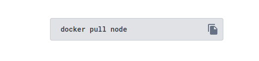

# Learning Docker

- [Learning Docker](#learning-docker)
  - [What is docker?](#what-is-docker)
  - [Get started](#get-started)
  - [Images and Containers](#images-and-containers)
  - [Creating Docker images](#creating-docker-images)
    - [Parent image](#parent-image)
      - [Pulling parent image](#pulling-parent-image)
      - [Listing pulled images](#listing-pulled-images)
      - [Removing pulled images](#removing-pulled-images)

## What is docker?

Docker allows you to package an application and its dependencies into a container, which is a lightweight, standalone, and executable software package. These containers run on a shared operating system kernel, but they are isolated from each other. Unlike virtual machines (VMs), which emulate an entire operating system and run on a hypervisor, containers share the host OS kernel and use resources more efficiently. Docker containers provide a consistent and reproducible environment, making it easier to develop, deploy, and scale applications across different environments.

## Get started

[Installing Docker](https://docs.docker.com/engine/install/ubuntu/#install-using-the-repository)

**Adding official repository:**

```sh
sudo apt-get update
sudo apt-get install ca-certificates curl gnupg
sudo install -m 0755 -d /etc/apt/keyrings
curl -fsSL https://download.docker.com/linux/ubuntu/gpg | sudo gpg --dearmor -o /etc/apt/keyrings/docker.gpg
sudo chmod a+r /etc/apt/keyrings/docker.gpg

# Add the repository to Apt sources:
echo \
  "deb [arch=$(dpkg --print-architecture) signed-by=/etc/apt/keyrings/docker.gpg] https://download.docker.com/linux/ubuntu \
  $(. /etc/os-release && echo "$VERSION_CODENAME") stable" | \
  sudo tee /etc/apt/sources.list.d/docker.list > /dev/null
sudo apt-get update
```

**Installation:**

```sh
sudo apt-get install docker-ce docker-ce-cli containerd.io docker-buildx-plugin docker-compose-plugin
```

**Testing installation:**

```sh
sudo docker run hello-world
```

**Output:**

```mono
Hello from Docker!
This message shows that your installation appears to be working correctly.

To generate this message, Docker took the following steps:
 1. The Docker client contacted the Docker daemon.
 2. The Docker daemon pulled the "hello-world" image from the Docker Hub.
    (amd64)
 3. The Docker daemon created a new container from that image which runs the
    executable that produces the output you are currently reading.
 4. The Docker daemon streamed that output to the Docker client, which sent it
    to your terminal.

To try something more ambitious, you can run an Ubuntu container with:
 $ docker run -it ubuntu bash

Share images, automate workflows, and more with a free Docker ID:
 https://hub.docker.com/

For more examples and ideas, visit:
 https://docs.docker.com/get-started/

```

## Images and Containers

**Images:**

On Docker images are the blueprints to create containers, which means that images has all the required configuration and dependencies for a container, as soon as you request Docker to run a image Docker will create a container following this blueprint.

**Containers:**

Containers are the pre-configured isolated environment created by Docker using an image

## Creating Docker images

Images are create by layers each layer will be responsible to define the structure that our container will have

The first layer of a image is called `parent image`, it will include the OS and some other runtime environment configuration

The other additional layers will be used add the source code, add dependencies and etc, but for now lets look further to the `parent image`

### Parent image

The first step to setup a parent image will be downloading it from [Docker hub](https://hub.docker.com/) in our example we will be looking for the official `node` parent image

On the Docker Hun we search for `node`


To download the official image that will be our parent image, you will notice a field with the respective command do download it:



But this the basic command, this will install the latest image version, if you want to install a specific version you will have to check the `Tag` section that lists all the available versions that can be used


> `alphine` suggests that this tag has the slimmest size

But for now let's install the latest version

#### Pulling parent image

```sh
sudo docker pull node
```

**Output:**

```mono
Using default tag: latest
latest: Pulling from library/node
90e5e7d8b87a: Pull complete 
27e1a8ca91d3: Pull complete 
d3a767d1d12e: Pull complete 
711be5dc5044: Pull complete 
22956530cc64: Pull complete 
5a84ca09aa3e: Pull complete 
27379e7795cc: Pull complete 
3a3f52d0acb3: Pull complete 
Digest: sha256:db2672e3c200b85e0b813cdb294fac16764711d7a66b41315e6261f2231f2331
Status: Downloaded newer image for node:latest
docker.io/library/node:latest
```

#### Listing pulled images

To list the images pulled run:

```sh
sudo docker images

# OR

sudo docker image ls
```

**Output:**

```mono
REPOSITORY    TAG       IMAGE ID       CREATED        SIZE
node          latest    b866e35a0dc4   12 days ago    1.1GB
hello-world   latest    9c7a54a9a43c   7 months ago   13.3kB
```

Alternatively you can list the version installed like this:

```sh
sudo docker images --format "{{.Repository}}:{{.Tag}}"
```

**Output:**

```mono
node:latest
hello-world:latest
```

#### Removing pulled images

To remove a image that is no longer used we use the following syntax: `sudo  docker rmi [OPTIONS] IMAGE[:TAG|@DIGEST]`

Let's remove the `hello-world` image used to test docker installation

```sh
sudo docker rmi hello-world:latest
```

**Output:**

```mono
Error response from daemon: conflict: unable to remove repository reference "hello-world:latest" (must force) - container daef4bf20a61 is using its referenced image 9c7a54a9a43c
```

Okay since the image is installed with docker we have to force it to be removed, for that we use the option `-f` just like we do with github

```sh
sudo docker rmi hello-world:latest -f
```

**Output:**

```mono
Untagged: hello-world:latest
Untagged: hello-world@sha256:c79d06dfdfd3d3eb04cafd0dc2bacab0992ebc243e083cabe208bac4dd7759e0
Deleted: sha256:9c7a54a9a43cca047013b82af109fe963fde787f63f9e016fdc3384500c2823d
```

Let's check if it worked:

```sh
sudo docker images
```

**Output:**

```mono
REPOSITORY   TAG       IMAGE ID       CREATED       SIZE
node         latest    b866e35a0dc4   12 days ago   1.1GB
```
